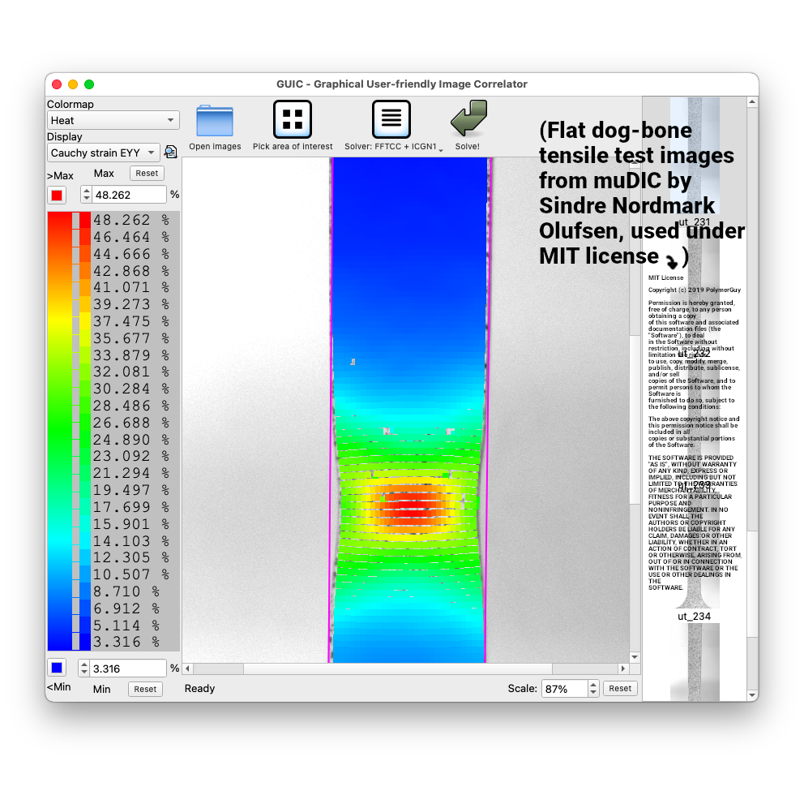

# GUIC - Graphical User-friendly Image Correlator

## About

## License

GPL version 3. The libraries used in the application may be distributed under other free software licenses, available in their respective subdirectories in the `ext` directory.

If the application's licensing is too restrictive for your commercial usecase, feel free to get in touch by emailing <a href="mailto:czcibor.bd@gmail.com">czcibor.bd@gmail.com. We may be able to come up with an arrangement that suits you better.</a>